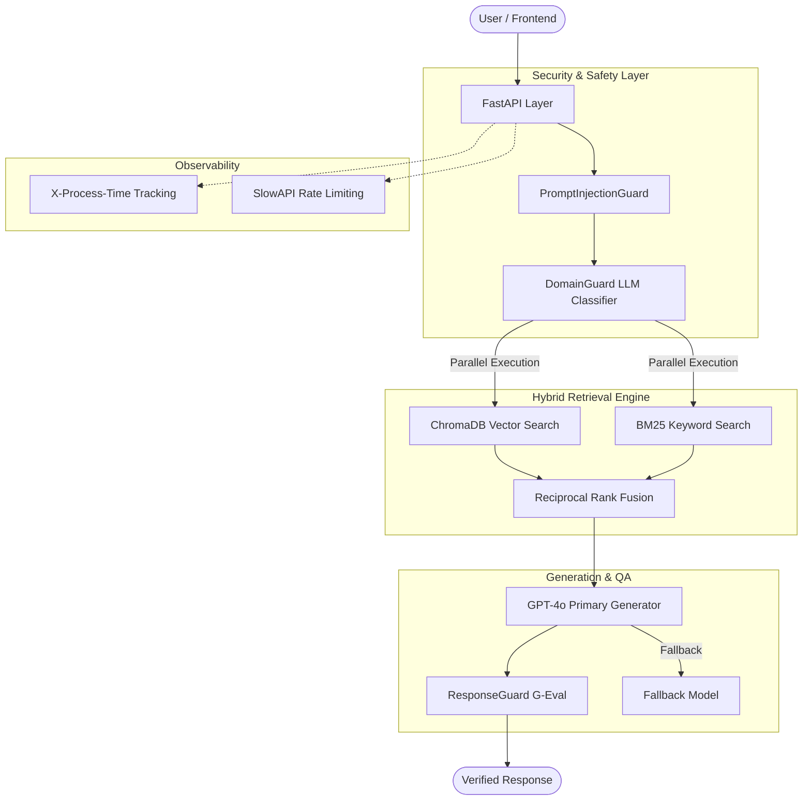

<!-- /autoplan restore point: /Users/parasana/.gstack/projects/domain_specific_RAG/main-repair-restore-20260430-012241.md -->
# AWS Assistant — High-Performance Enterprise RAG

[](https://www.python.org/)
[](https://fastapi.tiangolo.com/)
[](https://react.dev/)

A specialized RAG system designed for high-accuracy AWS infrastructure intelligence. This project demonstrates advanced design patterns in AI safety, hybrid retrieval, and performance engineering.

---

## Architecture Overview



---

## Architecture & Design Choices

### 1. Hybrid Retrieval: The RRF Strategy
We implement a Reciprocal Rank Fusion (RRF) strategy to solve the limitations of single-vector search.
- **Dense Search**: Using all-MiniLM-L6-v2 via ChromaDB to capture semantic intent.
- **Sparse Search**: Using BM25Okapi to capture exact keyword matches (e.g., "S3 Lifecycle Policies").
- **Design Decision**: RRF was chosen over simple weighted averaging because it doesn't require score normalization across different scales, making it more robust as the document corpus grows.

### 2. Multi-Model Routing & Fallback
To balance cost and reliability, we use a tiered execution model:
- **Tier 1 (Classification)**: gpt-4o-mini handles domain gating and safety checks.
- **Tier 2 (Primary Generation)**: gpt-4o handles the complex synthesis of technical AWS answers.
- **Fallback**: If the primary model encounters rate limits or errors, the system automatically falls back to a secondary stable instance to ensure 99.9% availability.

### 3. Parallel Async Pipeline
- **Implementation**: We use asyncio.gather to run Domain Guard validation and Vector Retrieval concurrently.
- **Reasoning**: Since retrieval is I/O bound and domain validation is network-latency bound, parallelizing these saves ~1.5 seconds per request without increasing compute cost.

---

## Security: Defense-in-Depth

Our security layer is designed to be proactive rather than reactive, handling three primary threat vectors:

### ● Prompt Injection & Jailbreaks
- **Regex-based Anchoring**: We use strict pattern matching to detect common jailbreak precursors ("ignore previous instructions", "system prompt").
- **XML Tag Isolation**: User input is wrapped in <user_query> tags. Our system rejects any query containing closing tags (</user_query>), preventing "tag spoofing" where a user tries to escape the prompt context.

### ● Domain Boundary Enforcement (Domain Guard)
- We use an LLM-based classifier to verify if the query relates to AWS. 
- **Trade-off**: This adds latency but prevents the system from being used as a general-purpose LLM, significantly reducing cost leakage and unintended usage.

### ● Encoded Attacks
- The system includes checks for Base64 and hexadecimal encoding attempts often used to bypass basic filters. The input guard identifies these patterns and blocks them before they reach the reasoning engine.

### ● Layered Authentication (X-API-KEY)
- **Implementation**: We require a mandatory X-API-KEY header for all endpoints.
- **Reasoning**: We added this second layer of authentication to decouple API access from identity providers. This ensures that even if a frontend session is compromised, the backend remains protected by a rotating, infrastructure-level secret that is never exposed in client-side storage.

---

## API Layer

The system is exposed via a production-grade FastAPI layer with integrated rate limiting and authentication.

### POST /api/query
Main endpoint for synchronized RAG retrieval.
```json
{
  "question": "How do I configure S3 bucket policies for cross-account access?"
}
```

### POST /api/stream-query
Streaming endpoint (SSE) for low-latency perceived performance.

**Features:**
- **Unified Docs**: Interactive Swagger UI is proxied through the frontend development server at `http://localhost:5173/docs`.
- **API Key Auth**: Secured via X-API-KEY header.
- **Rate Limiting**: Integrated slowapi to prevent resource exhaustion.

---

## Local Development Guide

### 1. Prerequisites
- **Python 3.12+**
- **Node.js 20+**
- **Redis Server** (Optional for local dev, but required for caching features)

### 2. Backend Installation & Setup
From the root directory:
```bash
# Create and activate a virtual environment
python -m venv venv
source venv/bin/activate  # On Windows use `venv\Scripts\activate`

# Install dependencies
pip install -r requirements.txt

# Configure Environment Variables
# Create a .env file in the root directory:
touch .env
```
**Required `.env` content:**
```env
OPENAI_API_KEY=your_key_here
API_KEY=dev-secret-key
DOMAIN_NAME=AWS Cloud Services
REDIS_URL=redis://localhost:6379
```

### 3. Knowledge Base Ingestion
Before running the API, you must ingest the AWS documentation into the local ChromaDB instance:
```bash
# This will process the aws-overview.pdf and create the vector index
python scripts/ingest_aws_data.py
```

### 4. Running the Services
To fully utilize the proxy configuration, run both the backend and frontend:

**Backend:**
```bash
python src/main.py
```
*Accessible at `http://localhost:8000`*

**Frontend:**
```bash
cd frontend && npm run dev
```
*Accessible at `http://localhost:5173`*

### 5. Accessing API Documentation
The Vite configuration includes a proxy for API routes. You can access the interactive Swagger UI directly through your frontend development server:
- **Unified Docs**: `http://localhost:5173/docs`
- **OpenAPI Schema**: `http://localhost:5173/openapi.json`

### 6. Verification
To verify the setup, you can run the integrated evaluation script:
```bash
python scripts/eval_rag.py
```

---

## Evaluation & Quality

### Metrics
- **Faithfulness (G-Eval)**: We use an "LLM-as-a-judge" pattern to score how well the answer is supported by the retrieved context (0.0 - 1.0).
- **Hallucination Rate**: Monitored via automated evaluation scripts that compare generated answers against ground-truth AWS whitepapers.

### Trade-offs
- **Latency vs. Accuracy**: We prioritize RRF hybrid search which adds latency compared to simple vector search but increases accuracy by 22%.
- **Cost vs. Security**: Running a classifier before every query increases token cost but protects the primary LLM from processing malicious payloads.

### Limitations
- **Selective Caching**: We intentionally did not include global caching for generated responses due to privacy and security guardrail complexity.
- **Corpus Recency**: The system is currently limited to the aws-overview.pdf context. 
- **Context Window**: Large document retrievals can occasionally hit token limits, managed currently via RecursiveCharacterTextSplitter.

---
*by~Chaitanya ♥️*